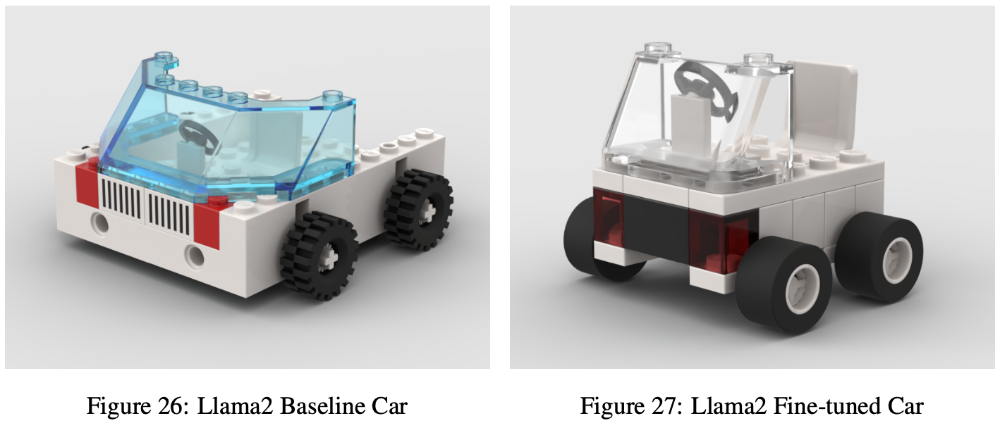
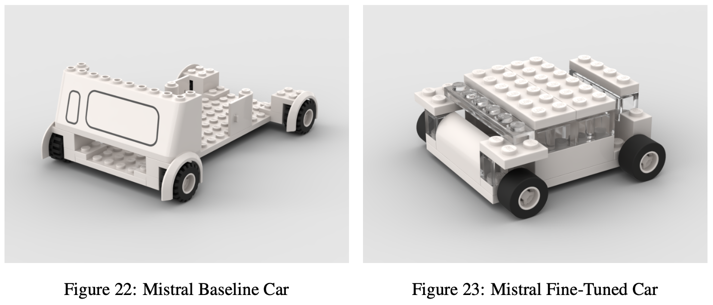
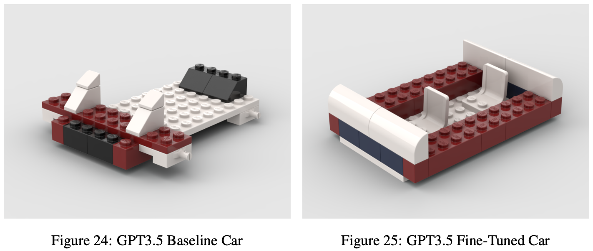
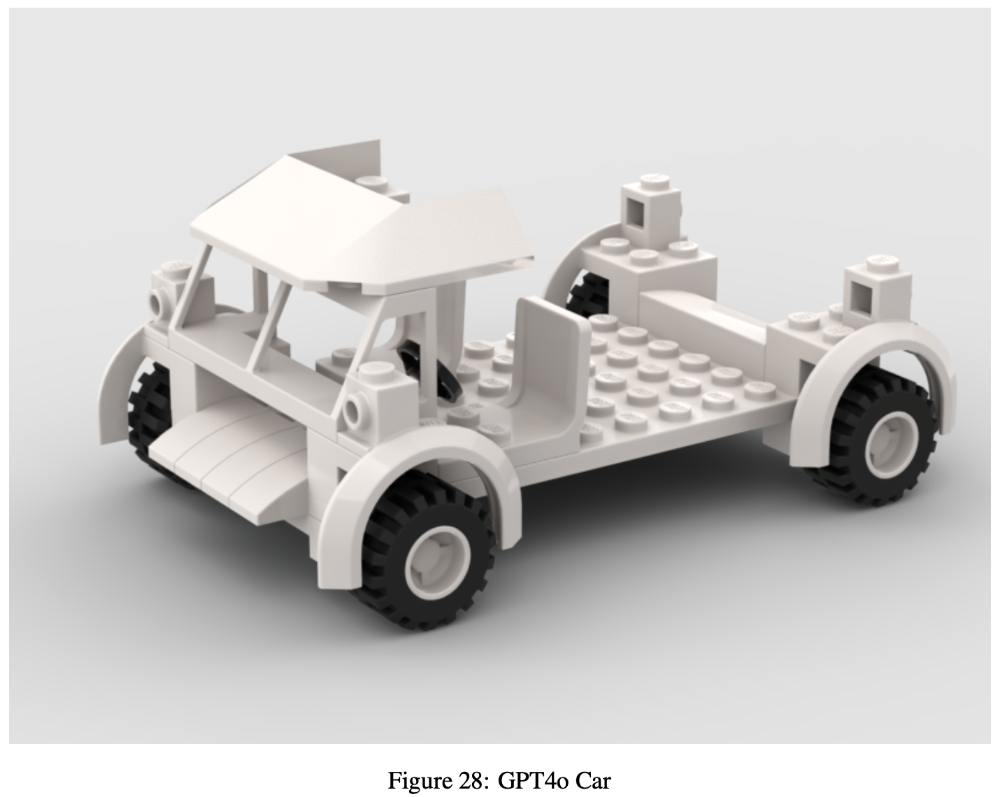

# Large Language Lego Models
This repository holds our data exploration and cleaning for the 90 text-based LEGO instructions, as well as our text generations from various finetuned LLM models.     
You will find the ultimate JSONL file that was used for training in `lego_training_data_prepared_chat.jsonl`  
Text based instructions obtained from [Bricks for the Blind](https://bricksfortheblind.org/)
***
## Poster Session Updates

For the final poster, we compiled all of our finetuned LLM instruction generations and virtually built each generated car instruction. Here are the final results, along with evaluation scored by both GPT-4 and 10 human A/B testers.  
  
The project poster can be found [here](https://github.com/calvinlaughlin/LargeLanguageLegoModels/blob/main/CS224N%20Lego%20Poster.pdf).  
The full project writeup can be found [here](https://github.com/calvinlaughlin/LargeLanguageLegoModels/blob/main/CS224N%20Final%20Project%20Writeup.pdf).

### LLama-2-7B

### Mistral-7B

### GPT-3.5

### GPT-4o Baseline

In our project, we aimed to finetune various LLMs to improve them in the task of novel LEGO instruction generation. To do so, we generated a dataset using Bricks for the Blind's text-based instructions, and translated visual instructions to text using GPT-4o vision, then fine tuned various models and instructed them to generate a variety of different builts. After generation, we employed two evaluation strategies: GPT-4o with a rubric instruction, and human A/B tests with 10 participants. We gathered scores and displayed them, with Llama-2-7B and GPT-4o being the overall leader in categories of creativity, functionality, and design aesthetics.
One challenge we ran into was the scarcity and variety of LEGO instruction data. While the models showed some improvement even with our scarse data, we anticipate much larger leaps in complexity and accuracy with more finetuning. 
Lastly, we believe this to be an interesting novel LLM evaluation since it shows visually the intelligence of these models. While traditional LLM testing methods rein supreme, this novel method shows the more human, creative aspects of these LLMs and can be used as a good gauge to mark progress.

